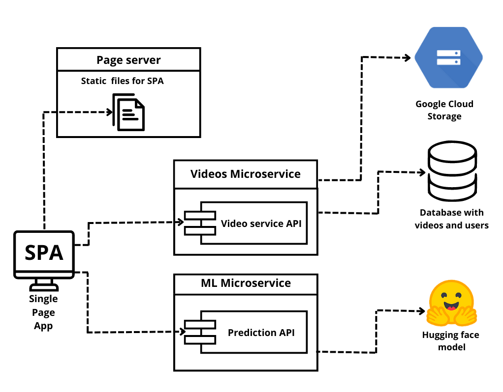

Julian Adolfo Vega - 2232569

Joyd Esteban Lasprilla - 2232563

Jorge Andres Facundo - 2232565

---

The next project is a web application that uses Machine Learning to extract information from videos and organize them in an easy-to-use library. With Video Organizer, users can upload videos in different formats and the app will automatically process metadata and preview images. Users can search and filter the library using key terms and keywords.

The project in general is divided in 3 fundamental fields.

* **SPA (Single Page App):** In charge of the direct interation with the user where can call the service necesarys to make interactions like register, login and create and modify videos.
* **Videos microservice:** In charge of recibe the user petitions based in REST protocol where using fundamentals functions like GET, POST, DELETE and PUT we can realize a comunication with a Postgress database (SQL) to create or modify videos.
* **ML microservice:** In charge of the 

We can see this principal fields in the following architecture:

## Architecture

## Solution description

* **How will your solution be used?**
* **What are the current solutions/workarounds (if any)?**
* **How would you solve the problem manually?**

